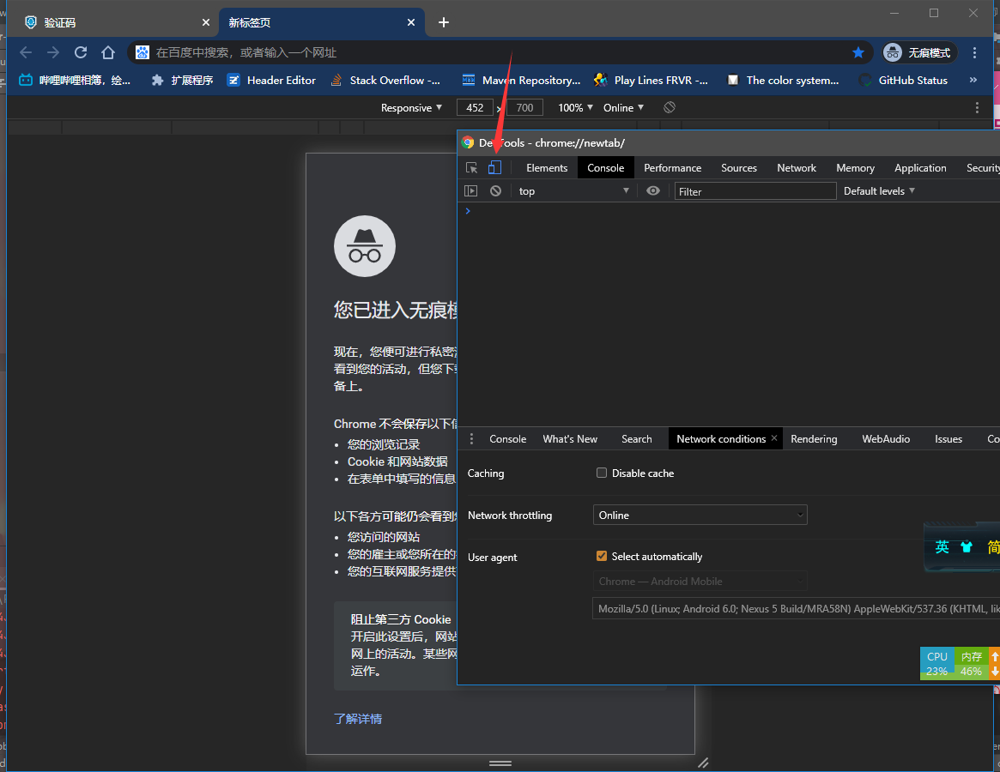
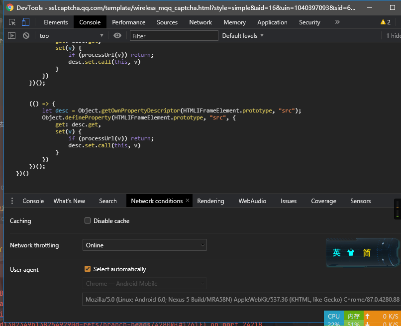
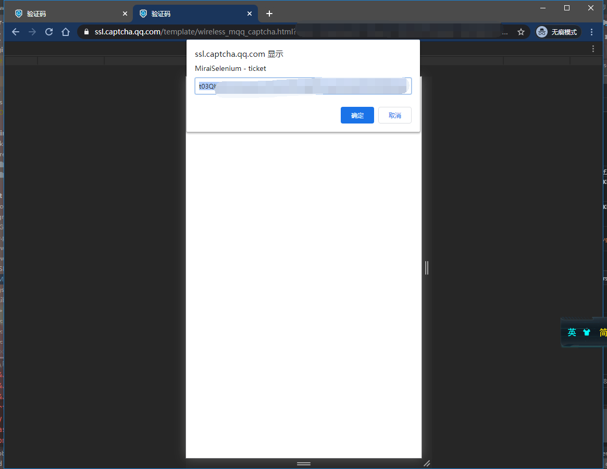

<div align="center">
   </br>


   

----
Mirai 是一个在全平台下运行，提供 QQ 协议支持的高效率机器人库

这个项目的名字来源于
<p><a href = "http://www.kyotoanimation.co.jp/">京都动画</a>作品<a href = "https://zh.moegirl.org/zh-hans/%E5%A2%83%E7%95%8C%E7%9A%84%E5%BD%BC%E6%96%B9">《境界的彼方》</a>的<a href = "https://zh.moegirl.org/zh-hans/%E6%A0%97%E5%B1%B1%E6%9C%AA%E6%9D%A5">栗山未来(Kuriyama <b>Mirai</b>)</a></p>
<p><a href = "https://www.crypton.co.jp/">CRYPTON</a>以<a href = "https://www.crypton.co.jp/miku_eng">初音未来</a>为代表的创作与活动<a href = "https://magicalmirai.com/2019/index_en.html">(Magical <b>Mirai</b>)</a></p>
图标以及形象由画师<a href = "">DazeCake</a>绘制
</div>

# mirai-login-solver-selenium

[  ](https://bintray.com/karlatemp/mirai/mirai-login-solver-selenium/_latestVersion)


该模块负责处理滑动验证码, `mirai-core` 并不强制要求使用 `mirai-login-solver-selenium`

使用时添加该模块至运行时 classpath 即可

## 运行平台支持

| OS      | Browser | 是否支持 |
| ------- | -----   | -----  |
| Windows | Chrome  | Yes    |
| Windows | Firefox | Yes    |
| CentOS  | Firefox | Yes    |
| Linux   | Firefox | 未测试  |
| Linux   | ------- | No     |
| MacOS   | Chrome  | Yes    |

```text
Windows - Chrome  - test ok
Windows - Firefox - test ok

CentOS  - Firefox - test ok
|    $ xdg-settings get default-web-browser
|    firefox.desktop
|    $ cat /proc/version 
|    Linux version 4.18.0-193.14.2.el8_2.x86_64 (mockbuild@kbuilder.bsys.centos.org) (gcc version 8.3.1 20191121 (Red Hat 8.3.1-5) (GCC)) #1 SMP Sun Jul 26 03:54:29 UTC 2020
|    $ uname -srm
|    Linux 4.18.0-193.14.2.el8_2.x86_64 x86_64
|    $ cat /etc/os-release 
|    NAME="CentOS Linux"
|    VERSION="8 (Core)"
|    ID="centos"
|    ID_LIKE="rhel fedora"
|    VERSION_ID="8"
|    PLATFORM_ID="platform:el8"
|    PRETTY_NAME="CentOS Linux 8 (Core)"
|    ANSI_COLOR="0;31"
|    CPE_NAME="cpe:/o:centos:centos:8"
|    HOME_URL="https://www.centos.org/"
|    BUG_REPORT_URL="https://bugs.centos.org/"
|
|    CENTOS_MANTISBT_PROJECT="CentOS-8"
|    CENTOS_MANTISBT_PROJECT_VERSION="8"
|    REDHAT_SUPPORT_PRODUCT="centos"
|    REDHAT_SUPPORT_PRODUCT_VERSION="8"


Linux   - Not tested
MacOS   - Chrome  - test ok
|    os.arch = x86_64
|    os.name = Mac OS X
|    os.version = 10.16
```

## 在 Mirai 使用

添加依赖即可.

`build.gradle`, `build.gradle.kts`
```kotlin
repositories {
    jcenter()
}

dependencies {
    runtimeOnly("net.mamoe:mirai-login-solver-selenium:1.0-dev-10")
}
```

## 在 MiraiConsole 中使用

### 使用 [Mirai Console Loader](https://github.com/iTXTech/mirai-console-loader) 安装 `Mirai login solver selenium`

* `MCL` 支持自动更新插件，支持设置插件更新频道等功能

`./mcl --update-package net.mamoe:mirai-login-solver-selenium --channel nightly --type plugin`

### 手动下载

```shell script
# 注: 自行更换对应版本号

# Download mirai-login-solver-selenium

curl -L https://maven.aliyun.com/repository/public/net/mamoe/mirai-login-solver-selenium/1.0-dev-10/mirai-login-solver-selenium-1.0-dev-10-all.jar -o mirai-login-solver-selenium-1.0-dev-10.jar

```
--------------------

## 手动完成滑动验证

注: 此章节针对的是**手动**完成验证

即在**不使用不依靠** mirai-login-solver-selenium 的情况下完成滑块验证码

**仅在 mirai-login-solver-selenium 无法使用的情况下考虑阅读此章节**

### 环境准备

在 `mirai` 运行时中添加 JVM 属性 `mirai.slider.captcha.supported` (添加参数 `-Dmirai.slider.captcha.supported`)
以确认手动完成滑动验证

> 对于 `mirai-console-loader`, 请使用任意一款文本编辑器打开 `mcl`/`mcl.bat`, 在 `java ..... -jar ....` 命令中的 `-jar`
> 前加入参数 `-Dmirai.slider.captcha.supported`
>
> `java ..... -Dmirai.slider.captcha.supported -jar ....`


准备一台拥有桌面系统的电脑, 并且需要安装支持 DevTools 的任意浏览器 (Eg `Chrome`, `Firefox`)

开启一个新的隐私窗口, 打开 `DevTools`, 并将运行模式切换为 `Android`



在该窗口打开滑动验证码页面, 并将 `DevTools` 的选项卡切换到 `Console`,

另外打开 [captcha.inject.js](src/main/resources/mirai-selenium/captcha.inject.js), 点击 `Raw` 按钮
将该文件内容完整复制进入 `DevTools > Console`, 然后按下 回车(`Enter`)



完成滑动验证码, 将会显示需要传回的 ticket



### 其他资料

- [go-cqhttp/docs/slider.md](https://github.com/Mrs4s/go-cqhttp/blob/master/docs/slider.md)
