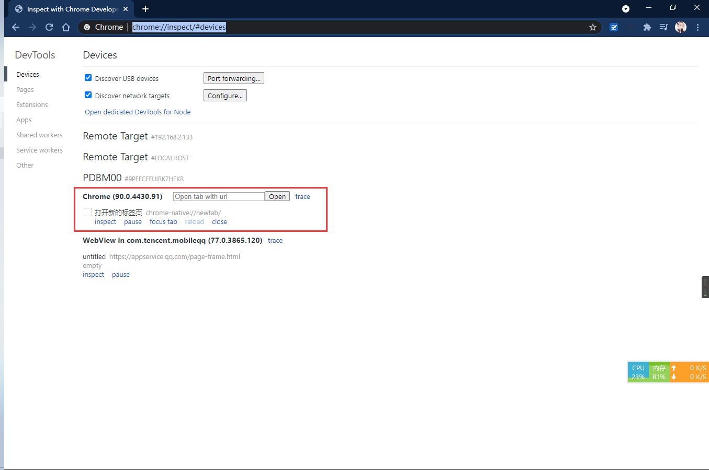
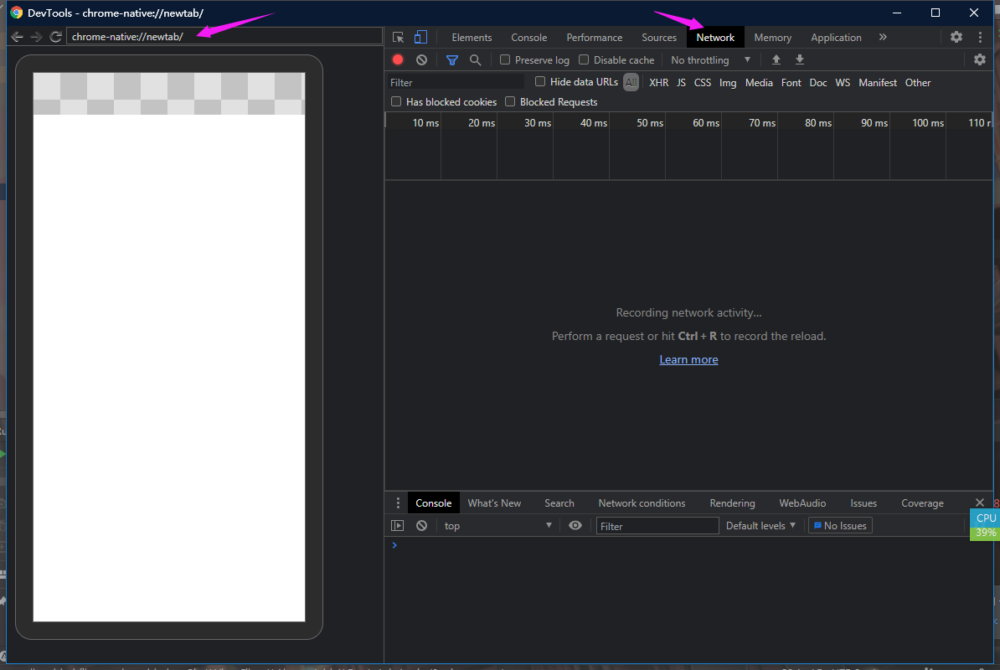
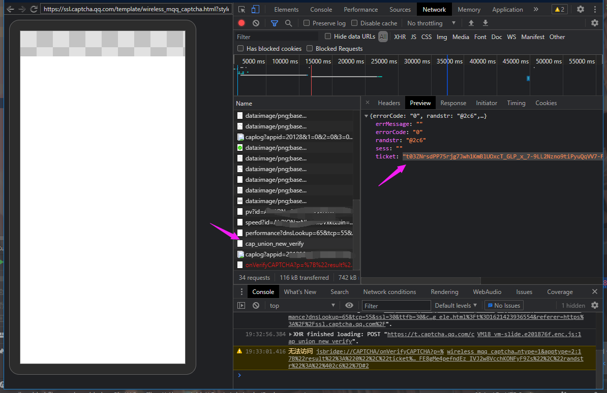
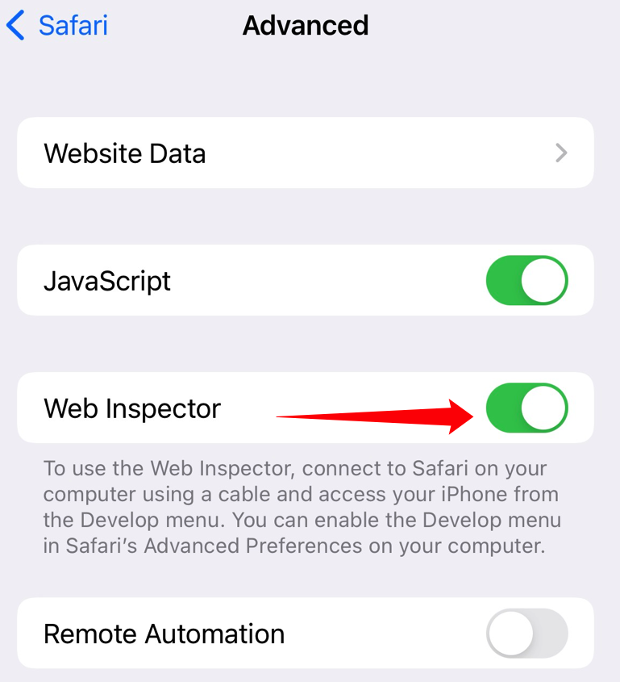
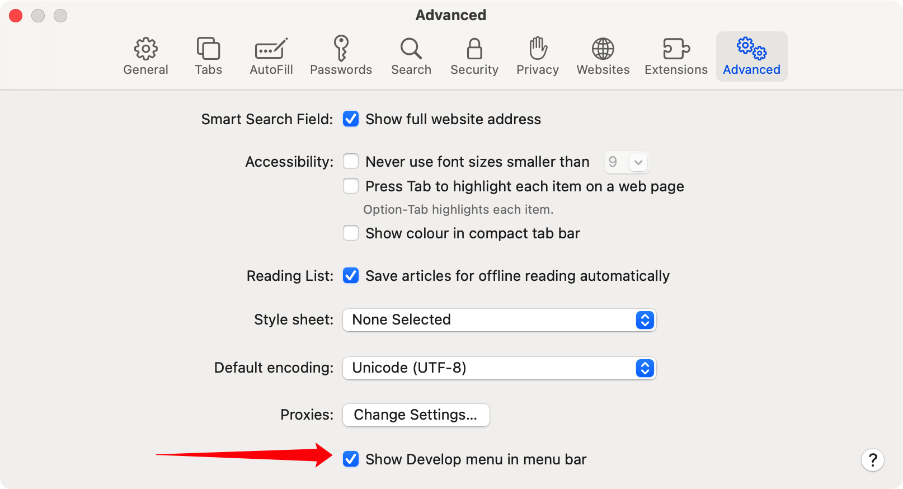
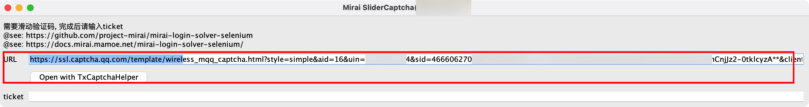
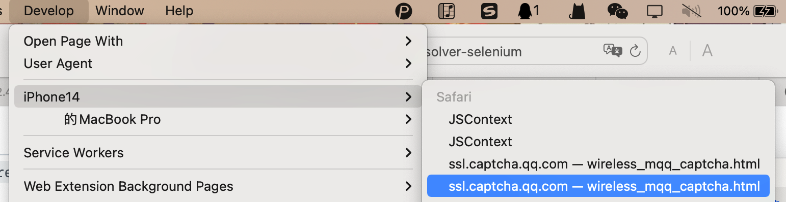
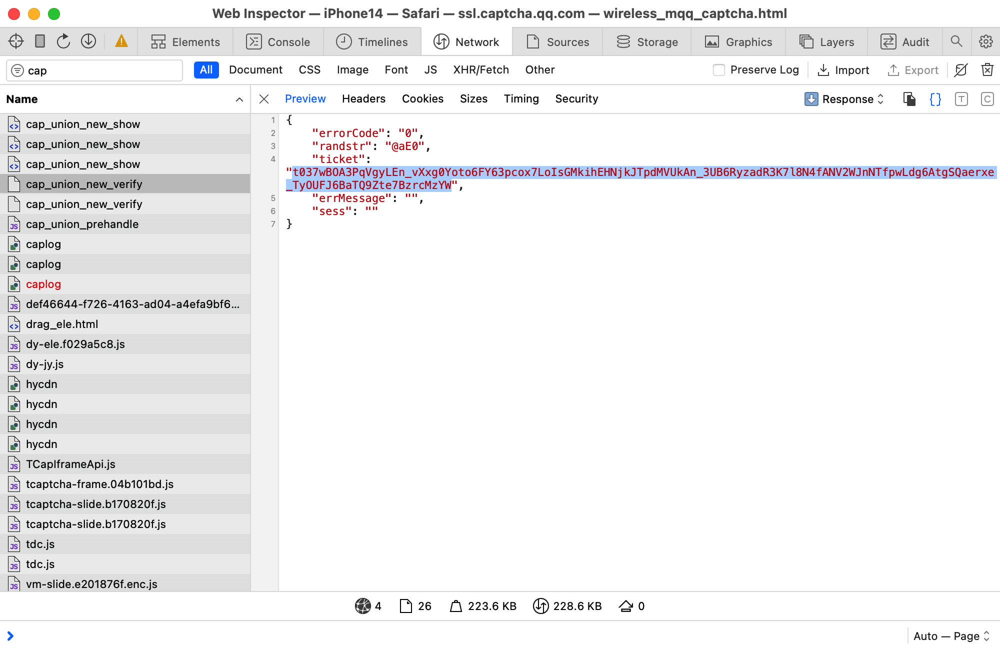

<h1></h1>

   

   

----
Mirai 是一个在全平台下运行，提供 QQ 协议支持的高效率机器人库

这个项目的名字来源于

<a href = "http://www.kyotoanimation.co.jp/">京都动画</a>作品<a href = "https://zh.moegirl.org/zh-hans/%E5%A2%83%E7%95%8C%E7%9A%84%E5%BD%BC%E6%96%B9">《境界的彼方》</a>的<a href = "https://zh.moegirl.org/zh-hans/%E6%A0%97%E5%B1%B1%E6%9C%AA%E6%9D%A5">栗山未来(Kuriyama <b>Mirai</b>)</a>

<a href = "https://www.crypton.co.jp/">CRYPTON</a>以<a href = "https://www.crypton.co.jp/miku_eng">初音未来</a>为代表的创作与活动<a href = "https://magicalmirai.com/2019/index_en.html">(Magical <b>Mirai</b>)</a>

图标以及形象由画师<a href = "">DazeCake</a>绘制

# mirai-login-solver-selenium

由于服务器再次更新验证逻辑，此模块已经无法正常工作

## 手动完成滑动验证

### 环境准备

在 `mirai` 运行时中添加 JVM 属性 `mirai.slider.captcha.supported` (添加参数 `-Dmirai.slider.captcha.supported`)
以确认手动完成滑动验证

> 对于 `mirai-console-loader`, 请使用任意一款文本编辑器打开 `mcl`/`mcl.bat`, 在 `java ..... -jar ....` 命令中的 `-jar`
> 前加入参数 `-Dmirai.slider.captcha.supported`
>
> `java ..... -Dmirai.slider.captcha.supported -jar ....`

> 注:
> - 如果运行于 `mirai-console`, 需要在 `plugins` 内删除 `mirai-login-solver-selenium` 插件
> - 如果直接基于 `mirai-core` 开发, 需要删除 `mirai-login-solver-selenium` 依赖

----

方法 1: 使用 [mzdluo123/TxCaptchaHelper](https://github.com/mzdluo123/TxCaptchaHelper)

----

方法 2:

**注: 使用此方法先不要进行登录**

准备一台电脑(`Require Chrome Desktop installed`),
一条数据线,
一台真手机(`Android System, require Chrome mobile installed`)

打开手机的 `USB 调试 / USB Debug`, 链接至电脑

然后在手机和电脑都打开 Chrome，并使电脑成功链接上手机 Chrome

> [Chrome Mobile Remote Debug](https://www.baidu.com/s?ie=UTF-8&wd=Chrome%20Mobile%20Remote%20Debug)

在电脑打开 `chrome://inspect/#devices`, 等待..... 直到以下页面出现

点击框中的 `inspect`

----

先点开 `Network`,
然后登入 mirai,
在 `chrome-native://newtab/` 位置输入验证码网页地址并按下回车

**注意: 先打开 Network 在输入地址**

完成验证, 在 `Network` 中找到名为 `cap_union_new_verify` 的请求, 在最下面

ticket 后那一坨就是要输入回 mirai 的内容

**注意**
- 复制的时候记得删掉引号(`"`, 前后都有一个), 那个不是ticket内容
- 速度要快
- 注意不要漏字符(没复制完, 后面还有很长)
  - 可以先开一次试一下手(不输入ticket) 然后重启进行滑块

---

方法 3:

此方法针对于 `MacOS + IOS`, 与方法2操作类似。

准备一台 Mac 电脑，准备一台手机，一条数据线（用于电脑和手机相连接）

在 IOS 设备上进入 `设置 -> Safari -> 高级`, 找到 `web inspector` 并开启

在 MacOS 的 Safari 中找到 `偏好设置 -> 高级`，打开选项在菜单栏中显示开发

手机和电脑都打开 Safari 浏览器，在手机上复制URL并打开网页

将手机和 Mac 之间用数据线连接

在开发中找到设备名称和打开的网页

打开后会出现 Web Inpector，这时在手机上拖动滑块，拖动后在网络上搜索 `cap_union_new_verify` 的请求。

截取其中 ticket 的内容即可。

